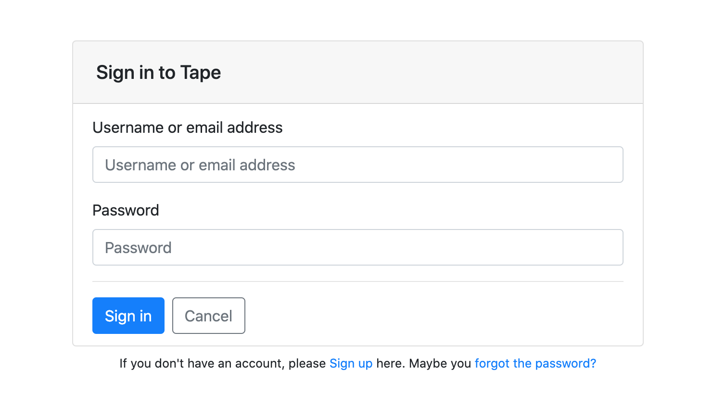
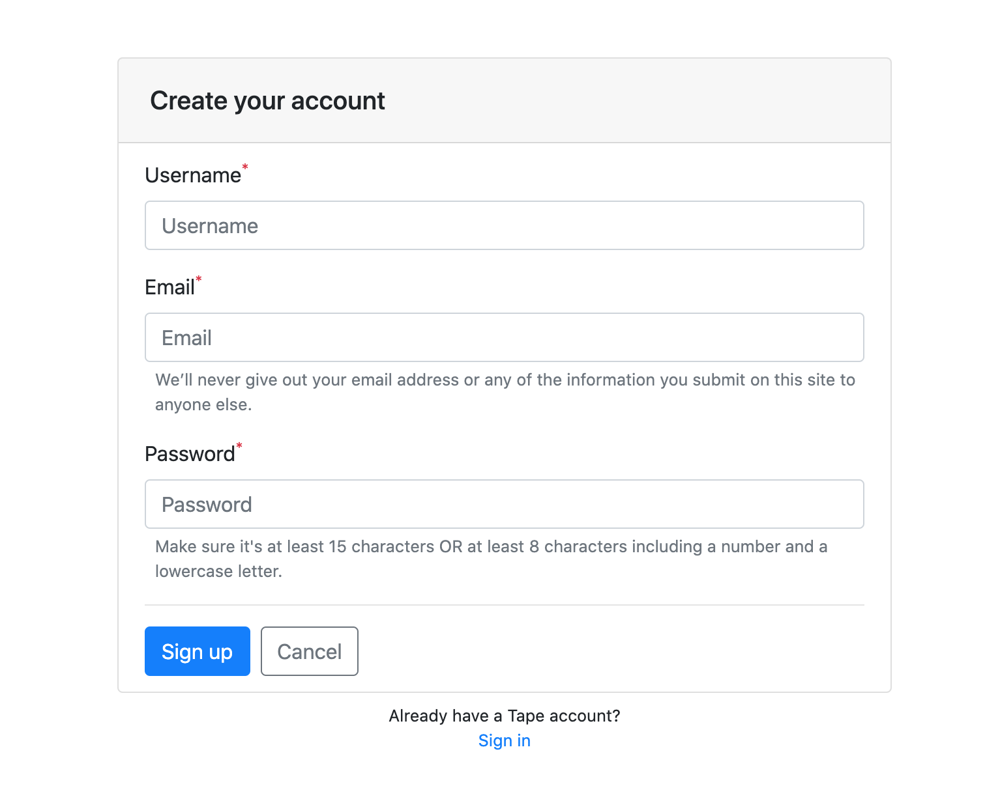

# Tape


---


--- 
.png)


## Aims

This project's aim to show how to develop real time messengers

## Give it a try

`$ git clone https://github.com/pashuka/tape.git`

`$ cd tape`

## Features

- Frontend Typescript - you can use types everywhere
- Backend Javascript - you can use only JS for now

## Used technologies:

- <b>Structure</b>: Yarn workspace
  - <b>Backend</b>: Koa2
  - <b>Frontend</b>: Create React App
    - <b>Language</b>: Typescript
    - <b>Linter</b>: Eslint
    - <b>Formatter</b>: Prettier

## Implemented Features

### SignIn



### SignUp




### Auto login


### Search users


### Send Direct Messages


### Reset password


### Emails

- Registration, activation email
- Reset password


# Development

`$ yarn dev`

This command runs in parralel two commands from workspaces:

- backend
- frontend

# Install

Update apt before

```sh
sudo apt update
```

Install main OS packages through `apt`

```sh
sudo apt -y install nginx postgresql postgresql-contrib curl dirmngr apt-transport-https lsb-release ca-certificates nodejs gcc g++ make git
```

Node.js

```sh
curl -sL https://deb.nodesource.com/setup_12.x | sudo -E bash -
```

Yarn packagage manager

```sh
curl -sS https://dl.yarnpkg.com/debian/pubkey.gpg | sudo apt-key add -
echo "deb https://dl.yarnpkg.com/debian/ stable main" | sudo tee /etc/apt/sources.list.d/yarn.list
sudo apt -y install yarn
```

Automatically enable HTTPS on your website with EFF's Certbot

```sh
sudo apt install certbot python3-certbot-nginx
```

Knex.js is a query builder for Postgres, MSSQL, MySQL, MariaDB, SQLite3, Oracle...

We use knex for rest api and data migration/seed

```sh
sudo yarn global add knex --prefix /usr/local
```

PM2 is a daemon process manager that will help you manage and keep your application online 24/7

```sh
sudo npm install pm2 -g
```

Generate ssh-keys for getting the fresh code from github repository with updates, bug fixes.

```sh
ssh-keygen -q -P "" -t ecdsa -C "deploy@domain.name"  -f ~/.ssh/tape.build.pm
cat .ssh/tape.build.pm.pub
```

And send me the public key, i'll add it to github deploy keys into tape repository, after this feedback and you can pulling each release updates

Add the following strings into ~/.ssh/config file:

```sh
vim .ssh/config
```

```
Host github.com
  HostName github.com
  User pashuka
  PreferredAuthentications publickey
  IdentityFile ~/.ssh/tape.build.pm
  IdentitiesOnly yes

```

Clone `tape` repository if you want to get daily updates

```sh
git clone git@github.com:pashuka/tape.git
cd tape/frontend/
cp .env.development .env.production
```

If you want to change some specials use `.env.production` file:

```sh
vim .env.production
```

Build app:

```sh
yarn install --network-timeout=30000
yarn build
```

Copy build to server path

```sh
sudo cp -R build/* ~/var/www/yourserverpath/
```

Go to backend dir

```sh
cd ../backend/
```

Be patient and add your server configuration envs

```sh
vim .env.production
```

Migrate schemas and seed if you need seeding data

```sh
knex migrate:latest --env production
knex seed:run --specific=002_fixtures.js --env production
```

Run backend api

```sh
pm2 start
```

#### Production

Building client side application:

```sh
echo
echo "Install packages"
yarn install --network-timeout=30000

cd ./frontend
echo
echo "Build"
yarn build

echo
echo "Copy to builds path"
sudo cp -R build/* ~/var/www/yourserverpath/
```

For run restapi backend service:

```sh
echo "yarn install"
yarn install

echo "restart node by: pm2 restart server"
pm2 restart api
```
